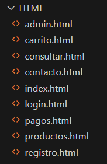
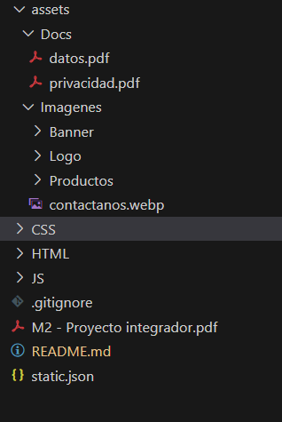
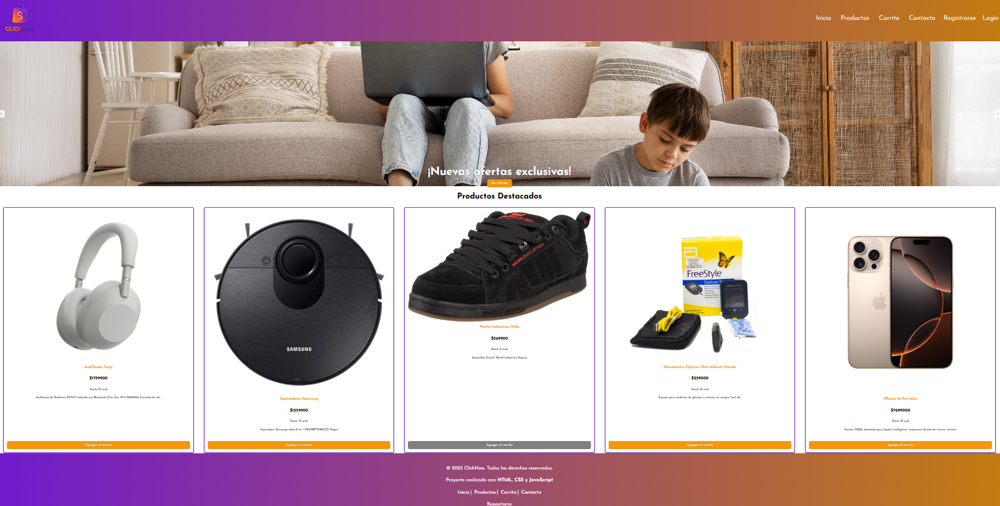
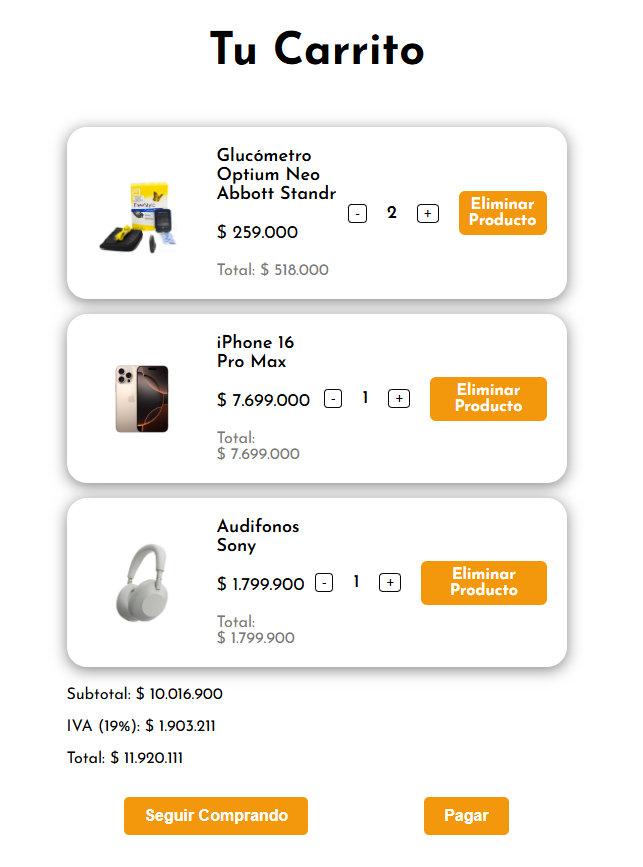

# Sprint2

## Función del proyecto

"ClickNow" es una plataforma virtual para la venta de accesorios, tecnología, moda, hogar y salud. Permite a los usuarios navegar por productos destacados, gestionar su carrito de compras, realizar pagos y administrar su cuenta, simulando el flujo completo de una tienda en línea.

## Desarrollo y tecnologías utilizadas

El proyecto fue desarrollado utilizando:

- **HTML5**: Estructura de las páginas y componentes.
- **CSS3**: Estilos, diseño responsivo y personalización visual.
- **JavaScript**: Lógica de interacción, gestión de datos en localStorage, validaciones y funcionalidades dinámicas.
- **GitHub**: Control de versiones y trabajo colaborativo.
- **Render**: plataforma para lanzar el proyecto y visualizarlo en línea.

## Funciones de cada archivo HTML

- **index.html**: Página principal, muestra el banner, productos destacados y navegación.
- **carrito.html**: Visualización y gestión del carrito de compras, permite modificar cantidades y eliminar productos.
- **registro.html**: Formulario para registro de nuevos usuarios.
- **login.html**: Formulario de inicio de sesión y validación de usuarios.
- **admin.html**: Panel administrativo, muestra información del usuario y detalles de órdenes realizadas.
- **contacto.html**: Formulario de contacto para consultas y soporte.
- **pagos.html**: Proceso de pago y confirmación de compra.

## Síntesis visual y experiencia de usuario

ClickNow proyecta un ambiente moderno y amigable, pensado para facilitar la navegación y la compra en línea. La estructura de la página es clara, con menús accesibles y secciones bien definidas que guían al usuario desde la exploración de productos hasta el proceso de pago. La teoría del color se aplica usando tonos neutros y acentos en colores vivos para destacar botones y elementos interactivos, transmitiendo confianza y dinamismo. El diseño responsivo asegura una experiencia óptima en cualquier dispositivo, mientras que la interfaz limpia y los mensajes claros mejoran la usabilidad. La experiencia de usuario (UX) se centra en la simplicidad, la rapidez y la satisfacción, permitiendo que cualquier persona pueda completar una compra de manera intuitiva y segura.

## Síntesis y experiencia de aprendizaje

Desarrollar una página robusta como ClickNow ha sido una experiencia enriquecedora. Permite comprender el ciclo completo de una aplicación web: desde la estructura y el diseño visual, hasta la lógica de negocio y la interacción con el usuario. El uso de JavaScript para simular bases de datos y procesos de autenticación, junto con la gestión de estados y la adaptación responsiva, fortalece habilidades clave para el desarrollo web moderno. Este proyecto es una herramienta de aprendizaje integral que acerca a los estudiantes a los retos reales de la programación y el diseño de plataformas digitales.